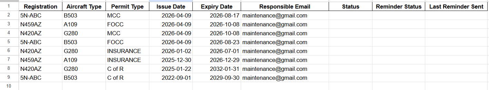
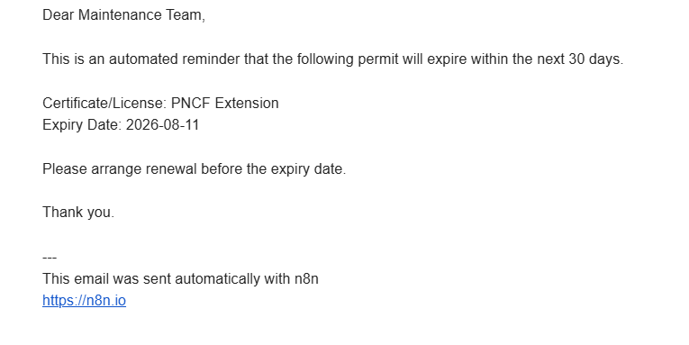

# ✈️ Aircraft Permit Reminder Automation

> An automated aircraft permit monitoring and notification system built with n8n, Google Sheets, Gmail, and JavaScript.

## 📌 Overview

The Aircraft Permit Reminder Automation monitors aircraft permit expiration dates and automatically notifies responsible personnel when action is required.

The system reads permit records from Google Sheets, calculates the remaining validity period, determines permit status, checks whether a reminder is required, sends automated email notifications, and updates the permit record.

This project demonstrates practical workflow automation applied to aviation operations and compliance monitoring.

## 🎯 Problem

Aircraft permits and operational documents have expiration dates that must be monitored carefully.

Manual monitoring can result in:

- Missed expiry dates
- Late renewals
- Repetitive administrative work
- Inconsistent reminder processes
- Duplicate notifications

## 💡 Solution

The workflow automates the complete reminder process:

```text
Google Sheets
     ↓
Read Permit Data
     ↓
Calculate Days Remaining
     ↓
Determine Permit Status
     ↓
Check Reminder Requirement
     ↓
Duplicate Reminder Check
     ↓
Send Gmail Notification
     ↓
Update Google Sheets

## ⚙️ Key Features

- Aircraft permit expiry monitoring
- Automatic status calculation
- Active / Due Soon / Expired classification
- 30-day reminder
- 14-day reminder
- 7-day reminder
- 1-day reminder
- Duplicate reminder prevention
- Last reminder tracking
- Automated Gmail notifications
- Automatic Google Sheets updates
- JavaScript-based business logic

## 🖼️ Screenshots

### n8n Workflow


### Permit Tracking Sheet



### Automated Email Reminder



## 🧩 Technologies Used

| Technology | Purpose |
|---|---|
| n8n | Workflow automation |
| JavaScript | Business logic and date calculations |
| Google Sheets | Permit data storage |
| Gmail | Automated notifications |
| JSON | Workflow configuration |
| Webhooks | Service integration |

## 🧠 Technical Skills Demonstrated

- Workflow automation
- Business process automation
- JavaScript
- Conditional logic
- Date calculations
- Data processing
- Google Workspace integration
- Email automation
- Duplicate prevention
- Compliance monitoring
- System integration

## 📊 Data Structure

The automation works with permit records containing:

| Field | Description |
|---|---|
| Registration | Aircraft registration |
| Aircraft Type | Aircraft model/type |
| Permit Type | Type of permit |
| Issue Date | Permit issue date |
| Expiry Date | Permit expiration date |
| Responsible Email | Notification recipient |
| Status | Current permit status |
| Reminder Status | Reminder processing status |
| Last Reminder Sent | Reminder history |

A demonstration dataset is included in `sample-aircraft-permit-data.csv`.

## 🔄 Workflow Process

1. Trigger the workflow.
2. Retrieve aircraft permit records.
3. Evaluate permit expiry dates.
4. Calculate days remaining.
5. Determine permit status.
6. Check whether a reminder is required.
7. Check previous reminder activity.
8. Send an email notification when required.
9. Update the permit record.
10. Continue monitoring future expiry conditions.

## 📁 Repository Structure

```text
aircraft-permit-reminder-automation/
│
├── README.md
├── workflow/
│   └── aircraft-permit-reminder.json
├── documentation/
│   └── workflow-overview.md
├── screenshots/
│   ├── workflow-overview.png
│   ├── permit-tracking-sheet.png
│   └── email-reminder.png
└── sample-aircraft-permit-data.csv

## 🔐 Security

This repository contains a sanitized portfolio version of the n8n workflow.

Sensitive information such as:

- API credentials
- OAuth credentials
- Passwords
- Private connection information
- Production database information
- Private operational data

has been removed.

## 🚀 Future Improvements

Planned improvements include:

- AI-powered compliance analysis
- Automatic document classification
- Permit status dashboard
- Slack notifications
- Microsoft Teams notifications
- Advanced reporting
- Database integration
- AI-generated compliance summaries

## 👨‍💻 Author

### Prince Jeremiah

**AI Automation Engineer | n8n Developer | Workflow Automation Specialist | Aviation Operations Professional**

Computer Science graduate combining aviation operations, IT, workflow automation, and AI technologies to build practical business automation solutions.

## 📌 Project Purpose

This project demonstrates the ability to identify a repetitive operational process, design an automated solution, integrate multiple services, implement business logic, and document the resulting workflow.
